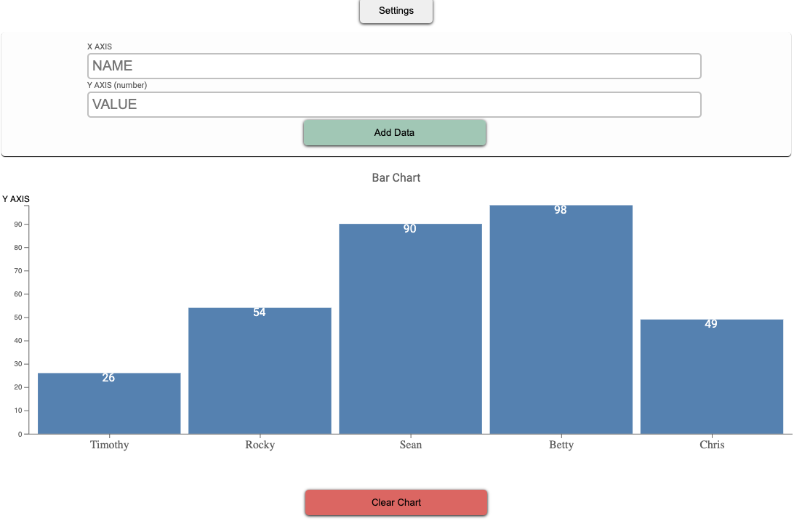

# Easy Chart Take 2

## Usage

You can add data and easily see the bar chart displayed.
Change settings of chart including colors, texts and chart name.

## About

Easy Charts goal is to allow users to input their data to create a bar chart using D3.js and get back the RAW HTML so the user can easily copy and paste into their own HTML files. 